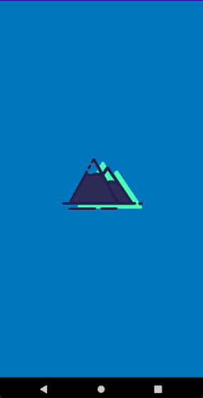
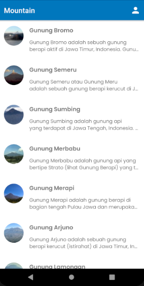
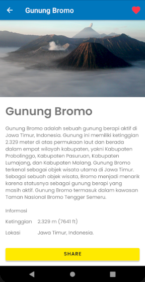
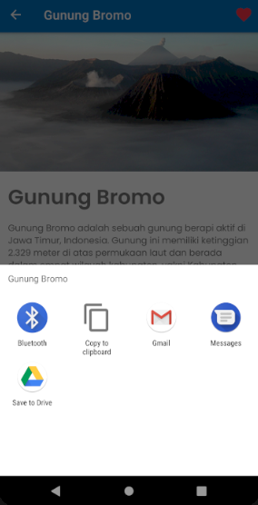

# Mountain-Belajar-Membuat-Aplikasi-Android-untuk-Pemula
Aplikasi daftar gunung - Belajar Membuat Aplikasi Android untuk Pemula
    <table cellpandding="15" cellspacing="5" border="1" align="center">
        <tbody>
        <tr>
          <th>Splash Screen</th>
            <th>Home</th>
        </tr>
         <tr>
          <td></td>
             <td></td>
        </tr>
           <tr>
             <th>About</th>
               <th>Detail</th>
          </tr>
           <tr>
              <td></td>
              <td></td>
          </tr>
           <tr>
              <th>Share</th>
          </tr>
           <tr>
              <td></td>
          </tr>
      </tbody>
    </table>
